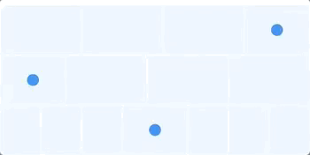
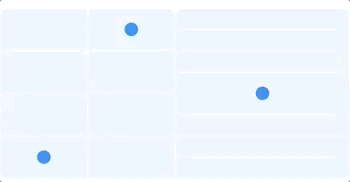
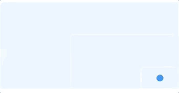

# PadControl
[](https://github.com/Carthage/Carthage)

A `UIControl` subclass for two-dimension directional input. Supports customization of color and other cosmetic attributes. To use with Carthage, add the following to your `Cartfile`:

```
github "gabrieloc/PadControl"
```

If you prefer not using Carthage, simply copy `PadControl.swift` into your project.


### Example Usage
Create an instance of `PadControl` by providing direction information (`PadDirections`). To create a unidirectional pad in your View Controller:
``` swift

override func viewDidLoad() {
	super.viewDidLoad

	let pad = PadControl(directions: [.up])
	pad.addTarget(self, action: #selector(padUpdated), for: .valueChanged)
	view.addSubview(pad)
}

@objc func padUpdated(sender: PadControl) {
	let value = sender.value(forDirection: .up)
	// value is a a Double from 0 - 1
}

```

Passing different directions allows for a variety of uni or bidirectional inputs to be created. For example:






To view all of these examples, refer to the app target in the main `.xcodeproj` entitled `PadControl Example`.

### FYI

PadControl is used by [SCARAB](https://itunes.apple.com/us/app/scarab-rc-controller-for-quadcopters/id1205279859), a free quadcopter controller for iOS. If you are interested in building quadcopter software, SCARAB is also powered by [QuadKit](https://github.com/gabrieloc/QuadKit), a framework for communicating with generic quadcopters.